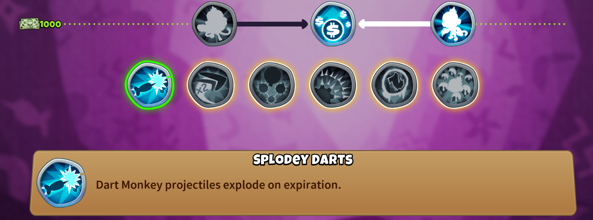
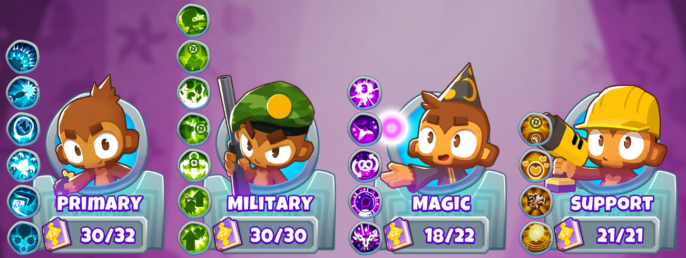

<h1 align="center">

Mega Knowledge
</h1>

### Adds in new extra powerful monkey knowledge effects.

You can find them at the bottom of the Primary, Military, Magic and Support trees.

Normally, you can have one Mega Knowledge active at a time for each of the four trees,
but once you've unlocked every normal Monkey Knowledge in the tree, then you can use all of them at once!

Or, if you don't care about progression, you can simply use the Shift and Alt modifiers while clicking the buttons to exactly control which ones you want to have active.

Many of the Mega Knowledge effects are based on premium/deluxe upgrades and specialty buildings from past Bloons games, but others are brand new.

## See [Here](MegaKnowledges/README.md#all-mega-knowledge-effects) for the full list of effects.

