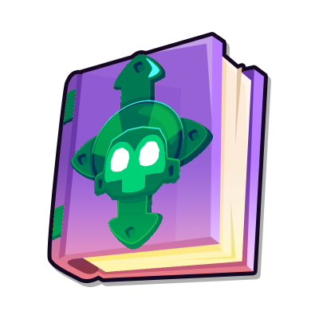

# Mega Knowledge

## NOTE: This alpha version of the mod requires BTD6 Mod Helper >v3.0, see [here](https://github.com/doombubbles/BTD6-Mods#readme) for the stable mods

This mod adds in new extra powerful monkey knowledge effects.
You can find them at the bottom of the Primary, Military, Magic and Support trees.

Normally, you can have one Mega Knowledge active at a time for each of the four trees,
but once you've unlocked every normal Monkey Knowledge in the tree, then you can use all of them at once!

Many of the Mega Knowledge effects are based on premium/deluxe upgrades and specialty buildings from past Bloons games, but others are brand new.

## See [Here](MegaKnowledges/README.md#all-mega-knowledge-effects) for full list of effects.